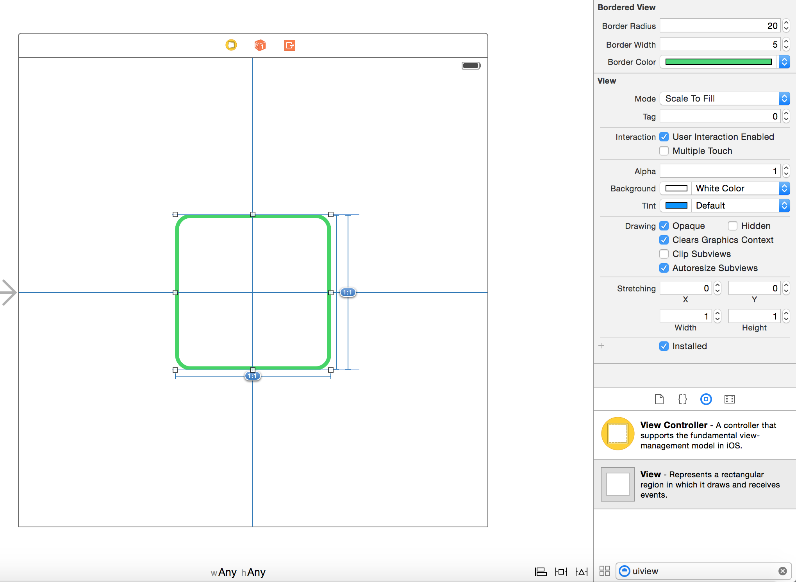

# BorderedView

[](http://cocoapods.org/pods/BorderedView)
[](http://cocoapods.org/pods/BorderedView)
[](http://cocoapods.org/pods/BorderedView)

An UIView subclass (in Swift) with corner radius, border width and border color configurable on Interface Builder.



## Usage

To run the example project, clone the repo, and run `pod install` from the Example directory first.

## Requirements

## Installation

BorderedView is available through [CocoaPods](http://cocoapods.org). To install
it, simply add the following line to your Podfile:

```ruby
pod "BorderedView"
```

## Author

Marcelo Fabri, me@marcelofabri.com

## License

BorderedView is available under the MIT license. See the LICENSE file for more info.
